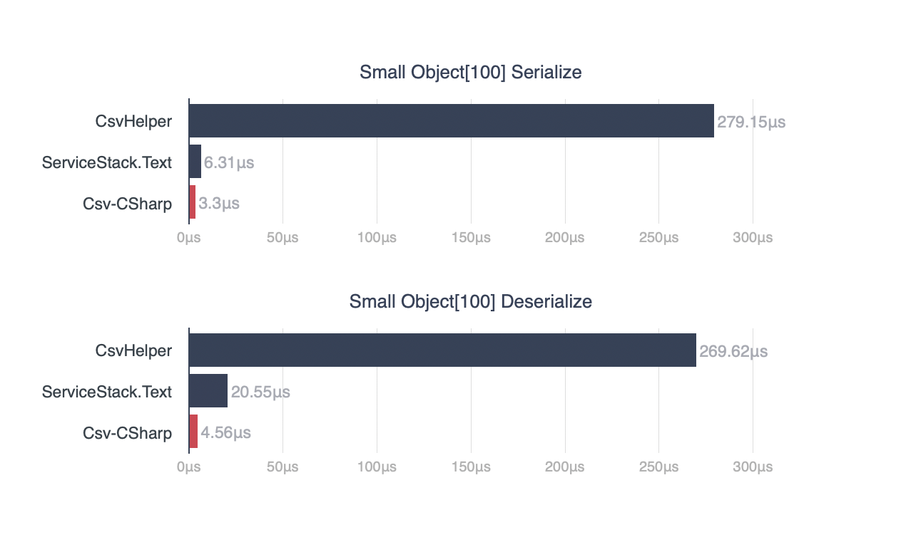

# Csv-CSharp

[](https://www.nuget.org/packages/CsvCSharp)
[](https://github.com/AnnulusGames/Csv-CSharp/releases)



Csv-CSharpは.NET、Unity向けの非常に高速なcsv(tsv)パーサです。UTF-8バイナリを直接解析する設計とSource Generatorの活用により、ゼロ(または非常に少ない)アロケーションでcsv(tsv)とオブジェクト配列間のシリアライズ/デシリアライズを可能にします。

## インストール

### NuGet packages

Csv-CSharpを利用するには.NET Standard2.1以上が必要です。パッケージはNuGetから入手できます。

```ps1
PM> Install-Package CsvCSharp
```

### Unity

[NugetForUnity](https://github.com/GlitchEnzo/NuGetForUnity)を利用することで、Csv-CSharpをUnityでインストールできます。詳細はNugetForUnityのREADMEを参照してください。

## クイックスタート

Csv-CSharpはcsvをclass/structの配列としてシリアライズ/デシリアライズします。

class/structを定義し、`[CsvObject]`属性とpartialキーワードを付加します。

```cs
[CsvObject]
public partial class Person
{
    [Column(0)]
    public string Name { get; set; }

    [Column(1)]
    public int Age { get; set; }
}
```

`[CsvObject]`属性でマークした型のpublicなフィールド/プロパティは全て`[Column]`または`[IgnoreMember]`属性を付加する必要があります。(どちらの属性も見つからないメンバーにはAnalyzerがコンパイルエラーを出力します。)

`[Column]`にはint型で列のインデックスを指定するか、string型でヘッダ名を指定することができます。

この型をcsvにシリアライズ、またはcsvからデシリアライズするには`CsvSerializer`を使用します。

```cs
var array = new Person[]
{
    new() { Name = "Alice", Age = 18 },
    new() { Name = "Bob", Age = 23 },
    new() { Name = "Carol", Age = 31 },
}

// Person[] -> CSV (UTF-8)
byte[] csv = CsvSerializer.Serialize(array);

// Person[] -> CSV (UTF-16)
string csvText = CsvSerializer.SerializeToString(array);

// CSV (UTF-8) -> Person[]
array = CsvSerializer.Deserialize<Person>(csv);

// CSV (UTF-16) -> Person[]
array = CsvSerializer.Deserialize<Person>(csvText);
```

SerializeはUTF-8でエンコードされた`byte[]`を返すオーバーロードのほか、`Stream`や`IBufferWriter<byte>`を渡して書き込みを行うことも可能です。DeserializeはUTF-8バイト配列の`byte[]`を受け取るほか、`string`、`Stream`、`ReadOnlySequence<byte>`にも対応しています。

フィールドに含める型は、デフォルトでは`sbyte`, `byte`, `short`, `ushort`, `int`, `uint`, `long`, `ulong`, `char`, `string`, `Enum`, `Nullable<T>`, `DateTime`, `TimeSpan`, `Guid`に対応しています。これ以外の型に対応したい場合は機能拡張のセクションを参照してください。

## シリアライズ

`CsvSerializer`に渡すclass/structには`[CsvObject]`属性とpartialキーワードを付加します。

デフォルトでは`[Column]`属性が付加されたフィールドとプロパティがSerialize/Deserialzeの対象になります。publicなメンバーには属性が必須ですが、`[Column]`属性を付加すればprivateメンバーを対象にすることも可能です。

```cs
[CsvObject]
public partial class Person
{
    [Column(0)]
    public string Name { get; set; }

    [Column(1)]
    int age;

    [IgnoreMember]
    public int Age => age;
}
```

インデックスではなくヘッダ名を指定したい場合は文字列をキーに指定します。

```cs
[CsvObject]
public partial class Person
{
    [Column("name")]
    public string Name { get; set; }

    [Column("age")]
    public int Age { get; set; }
}
```

メンバー名をそのままキーとして使用する場合は`[CsvObject(keyAsPropertyName: true)]`を指定します。この場合、`[Column]`属性は必要ありません。

```cs
[CsvObject(keyAsPropertyName: true)]
public partial class Person
{
    public string Name { get; set; }
    public int Age { get; set; }
}
```

> [!NOTE]
> 現在コンストラクタを指定するDeserializeは未実装であり、`[CsvObject]`をマークした型にはパラメータなしのコンストラクタが必要です。この機能はv1.0までに実装される予定です。

## オプション

Serialize/Deserializeに`CsvOptions`を渡すことでcsvの設定を変更することができます。

```cs
CsvSerializer.Serialize(array, new CsvOptions()
{
    HasHeader = true, // ヘッダ行を含むか
    AllowComments = true, // #から始まるコメントを許可するか
    NewLine = NewLineType.LF, // 改行コード
    Separator = SeparatorType.Comma, // 区切り文字
    QuoteMode = QuoteMode.Minimal, // フィールドをダブルクォーテーションで囲む条件 (Minimalはエスケープ文字を含む文字列のみエスケープ)
    FormatterProvider = StandardFormatterProvider.Instance, // 使用するICsvFormatterProvider
});
```

## CSVの仕様

Csv-CSharpのデフォルトの設定は概ね[RFC 4180](https://www.rfc-editor.org/rfc/rfc4180.html)で規定された仕様に従いますが、パフォーマンスや実用性の観点から一部の仕様を無視することに注意してください。

- 改行コードのデフォルトはCRLFではなくLFです。
- フィールド数が不一致のレコードも読み取りが可能です。(エラーは出力されず、初期値のままになります。)

## 機能拡張

フィールドのSerialize/Deserialzeをカスタマイズするためのインターフェースとして`ICsvFormatter<T>`、 `ICsvFormatterProvider`が提供されています。

型のSerialize/Deserialzeには`ICsvFormatter<T>`を使用します。例として`int`型をラップする構造体に対応したFormatterの実装を示します。

```cs
public struct Foo
{
    public int Value;

    public Foo(int value)
    {
        this.Value = value;
    }
}

public sealed class FooFormatter : ICsvFormatter<Foo>
{
    public Foo Deserialize(ref CsvReader reader)
    {
        var value = reader.ReadInt32();
        return new Foo(value);
    }

    public void Serialize(ref CsvWriter writer, Foo value)
    {
        writer.WriteInt32(value.Value);
    }
}
```

続いてFormatterを取得するためのFormatterProviderを実装します。

```cs
public class CustomFormatterProvider : ICsvFormatterProvider
{
    public static readonly ICsvFormatterProvider Instance = new CustomFormatterProvider();

    CustomFormatterProvider()
    {
    }

    static CustomFormatterProvider()
    {
        FormatterCache<Foo>.Formatter = new FooeFormatter();
    }

    public ICsvFormatter<T>? GetFormatter<T>()
    {
        return FormatterCache<T>.Formatter;
    }

    static class FormatterCache<T>
    {
        public static readonly ICsvFormatter<T> Formatter;
    }
}
```

作成したFormatterProviderはCsvOptionsにセットできます。上の`CustomFormatterProvider`は`Foo`構造体にのみ対応したものであるため、標準のFormatterProviderである`StandardFormatterProvider`と組み合わせて使用します。

```cs
var array = new Foo[10];

// CompositeFormatterProviderで複数のFormatterProviderをまとめたFormatterProviderを作成する
var provider = CompositeFormatterProvider.Create(
    CustomFormatterProvider.Instance,
    StandardFormatterProvider.Instance
);

CsvSerializer.Serialize(array, new CsvOptions()
{
    FormatterProvider = provider
});
```

## ライセンス

このライブラリはMITライセンスの下に公開されています。